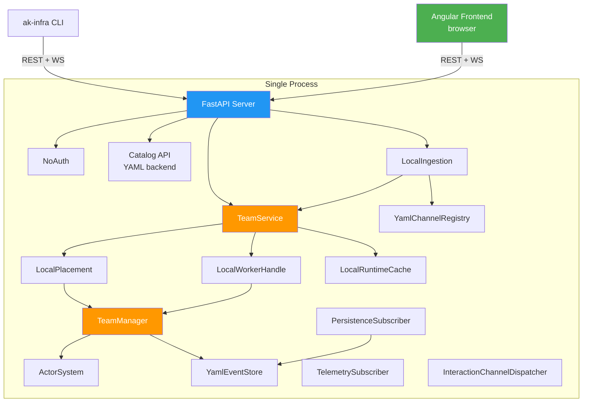
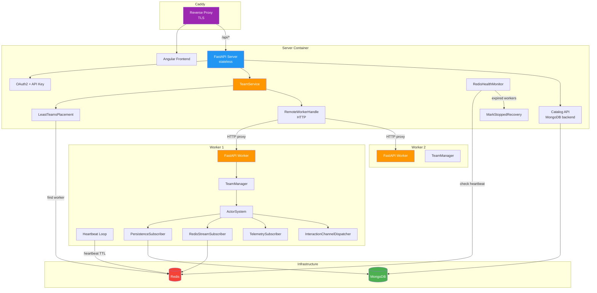
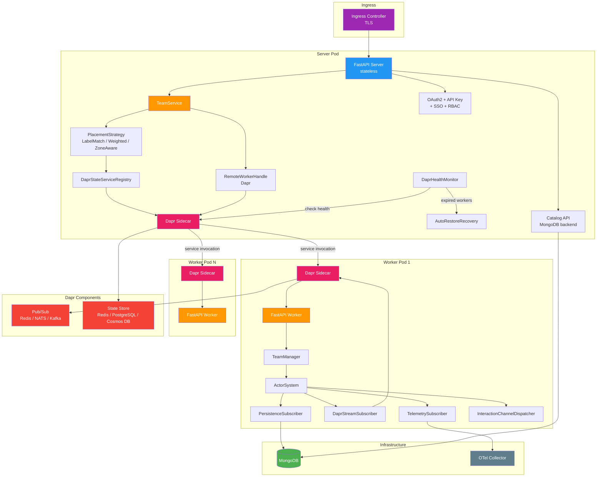

# akgentic-infra

**Status:** Beta — Community tier complete, department/enterprise tiers planned.

## What is akgentic-infra?

Infrastructure backend for the Akgentic platform. It provides protocol abstractions that decouple the server and CLI from any specific deployment model, plus a complete set of community-tier implementations for single-process deployment. Implement the protocols to build department (Docker Compose) or enterprise (Kubernetes/Dapr) tiers.

## Three-Tier Architecture

| Capability        | Community              | Department                    | Enterprise                         |
|-------------------|------------------------|-------------------------------|------------------------------------|
| Auth              | `NoAuth`               | OAuth2 + API key              | OAuth2 + API key + SSO + RBAC      |
| Placement         | `LocalPlacement`       | `LeastTeamsPlacement`         | LabelMatch / Weighted / ZoneAware  |
| Worker lifecycle  | `LocalWorkerHandle`    | `RemoteWorkerHandle` (HTTP)   | `RemoteWorkerHandle` (Dapr)        |
| Team interaction  | `LocalTeamHandle`      | Remote (HTTP proxy)           | Remote (Dapr service invocation)   |
| Runtime cache     | `LocalRuntimeCache`    | Redis-backed                  | Dapr State Store                   |
| Persistence       | `YamlEventStore`       | MongoDB                       | MongoDB + Dapr State               |
| Health monitoring | None (single process)  | `RedisHealthMonitor`          | `DaprHealthMonitor`                |
| Recovery          | None (single process)  | `MarkStoppedRecovery`         | `AutoRestoreRecovery`              |
| Channels          | `YamlChannelRegistry`  | Redis-backed                  | Dapr pub/sub                       |
| Worker discovery  | N/A (same process)     | HTTP via Redis-registered URLs| Dapr service invocation            |
| Observability     | Logfire (direct)       | Logfire (direct)              | Logfire + OTel Collector           |
| Workspace storage | Local filesystem       | Docker named volume           | NFS / EFS                          |

### Community (single process)



### Department (Docker Compose)



### Enterprise (Kubernetes / Dapr)



## Quick Start

```bash
# Start the community-tier server
ak-infra chat --create my-team-entry

# Or start the server programmatically
python -c "
from akgentic.infra.server.app import create_app
from akgentic.infra.server.settings import CommunitySettings
from akgentic.infra.wiring import wire_community
import uvicorn

settings = CommunitySettings()
services = wire_community(settings)
app = create_app(services, settings)
uvicorn.run(app, host=settings.host, port=settings.port)
"
```

## Protocols

These are the contracts that department/enterprise tiers must implement. All use structural subtyping (`typing.Protocol`) — no inheritance required.

| Protocol                       | File              | Abstracts                                     |
|--------------------------------|-------------------|-----------------------------------------------|
| `PlacementStrategy`            | `placement.py`    | Worker selection and team creation             |
| `WorkerHandle`                 | `worker_handle.py`| Team stop / delete / resume / get             |
| `TeamHandle`                   | `team_handle.py`  | Send messages, route human input, subscribe   |
| `RuntimeCache`                 | `team_handle.py`  | Map team IDs to live TeamHandle instances      |
| `AuthStrategy`                 | `auth.py`         | Request authentication and user extraction     |
| `InteractionChannelAdapter`    | `channels.py`     | Outbound message delivery to external channels |
| `InteractionChannelIngestion`  | `channels.py`     | Inbound webhook routing to teams               |
| `ChannelParser`                | `channels.py`     | Parse channel-specific webhook payloads        |
| `ChannelRegistry`              | `channels.py`     | Map external channel users to active teams     |
| `HealthMonitor`                | `health.py`       | Worker liveness detection                      |
| `RecoveryPolicy`               | `recovery.py`     | Recovery behavior on worker failure            |

## Server Architecture

The server is built around a tier-agnostic `TeamService` that delegates all infrastructure concerns to protocol implementations. The `create_app()` factory wires everything together.

### REST API

| Method   | Path                            | Description                          |
|----------|---------------------------------|--------------------------------------|
| `POST`   | `/teams/`                       | Create a team from a catalog entry   |
| `GET`    | `/teams/`                       | List all teams                       |
| `GET`    | `/teams/{team_id}`              | Get team metadata                    |
| `DELETE` | `/teams/{team_id}`              | Stop and delete a team               |
| `POST`   | `/teams/{team_id}/message`      | Send a message to a running team     |
| `POST`   | `/teams/{team_id}/human-input`  | Provide human input to an agent      |
| `POST`   | `/teams/{team_id}/stop`         | Stop a team (preserve data)          |
| `POST`   | `/teams/{team_id}/restore`      | Restore a stopped team               |
| `GET`    | `/teams/{team_id}/events`       | Get persisted events                 |
| `GET`    | `/workspace/{team_id}/tree`     | List workspace files                 |
| `GET`    | `/workspace/{team_id}/file`     | Read a workspace file                |
| `POST`   | `/workspace/{team_id}/file`     | Upload a file to workspace           |
| `WS`     | `/ws/{team_id}`                 | Real-time event stream               |
| `POST`   | `/webhook/{channel}`            | Inbound channel webhook              |

Catalog endpoints are mounted under `/catalog/` and provided by `akgentic-catalog`.

### Frontend Adapter Plugin

An optional plugin system for translating API responses to legacy frontend formats. Configured via `AKGENTIC_FRONTEND_ADAPTER` (FQDN of the adapter class). When absent, the server serves the native V2 API only.

## CLI

The `ak-infra` command provides a terminal interface to the server.

### Team management

```bash
ak-infra team list                      # List all teams
ak-infra team get <team_id>             # Show team detail
ak-infra team create <catalog_entry>    # Create a team
ak-infra team delete <team_id>          # Delete a team
ak-infra team restore <team_id>         # Restore a stopped team
ak-infra team events <team_id>          # Show team events
```

### Messaging

```bash
ak-infra message <team_id> <content>                    # Send a message
ak-infra reply <team_id> <content> --message-id <id>    # Reply to agent request
ak-infra chat [TEAM_ID]                                 # Interactive REPL
ak-infra chat --create <catalog_entry>                   # Create + chat
```

### Workspace

```bash
ak-infra workspace tree <team_id>                  # List files
ak-infra workspace read <team_id> <path>            # Read a file
ak-infra workspace upload <team_id> <local_path>    # Upload a file
```

### REPL Commands

Inside `ak-infra chat`, use `/` for slash commands:

| Command             | Description                    |
|---------------------|--------------------------------|
| `/help`             | Show available commands        |
| `/status`           | Show team status               |
| `/agents`           | List team agents               |
| `/history [N]`      | Show recent messages           |
| `/files`            | Show workspace files           |
| `/read <path>`      | Read a workspace file          |
| `/upload <path>`    | Upload a file                  |
| `/stop`             | Stop the team                  |
| `/restore`          | Restore a stopped team         |
| `/switch <team_id>` | Switch to another team         |

### Global Options

```bash
ak-infra --server http://localhost:8000   # Server URL (default)
ak-infra --api-key <key>                  # API key for auth
ak-infra --format table|json              # Output format
```

## Configuration

All settings are loaded from environment variables prefixed with `AKGENTIC_`.

### Server Settings (all tiers)

| Variable                       | Default       | Description                      |
|--------------------------------|---------------|----------------------------------|
| `AKGENTIC_HOST`                | `0.0.0.0`    | Bind address                     |
| `AKGENTIC_PORT`                | `8000`        | Port number                      |
| `AKGENTIC_CORS_ORIGINS`        | `["*"]`       | Allowed CORS origins             |
| `AKGENTIC_FRONTEND_ADAPTER`    | `None`        | Frontend adapter plugin FQDN     |

### Community Settings (extends server)

| Variable                       | Default        | Description                        |
|--------------------------------|----------------|------------------------------------|
| `AKGENTIC_WORKSPACES_ROOT`     | `workspaces`   | Root directory for team storage    |
| `AKGENTIC_CATALOG_PATH`        | `None`         | Catalog directory (auto-derived)   |

## Installation

### Within Monorepo Workspace

```bash
# From workspace root
source .venv/bin/activate

# Package is already installed in editable mode via workspace
# No additional installation needed
```

### Standalone Package

```bash
cd packages/akgentic-infra

uv venv
source .venv/bin/activate
uv pip install -e ".[dev]"
```

## Development

```bash
# Run all tests
pytest packages/akgentic-infra/tests/

# Run integration tests (requires API keys in .env)
pytest packages/akgentic-infra/tests/integration/ -m integration

# Type checking (strict mode)
mypy packages/akgentic-infra/src/

# Lint
ruff check packages/akgentic-infra/src/

# Format
ruff format packages/akgentic-infra/src/
```

Coverage target: **90%** (higher than other packages at 80%).

## Dependencies

### Akgentic packages

`akgentic-core`, `akgentic-team`, `akgentic-catalog`, `akgentic-agent`, `akgentic-llm`, `akgentic-tool`

### Third-party

| Package             | Purpose                                |
|---------------------|----------------------------------------|
| `fastapi`           | HTTP server framework                  |
| `pydantic-settings` | Environment-based configuration        |
| `typer`             | CLI framework                          |
| `rich`              | Terminal rendering                     |
| `httpx`             | HTTP client (CLI to server)            |
| `websockets`        | WebSocket client and server            |
| `pyyaml`            | YAML persistence (event store, catalog)|
| `logfire`           | Observability and logging              |
