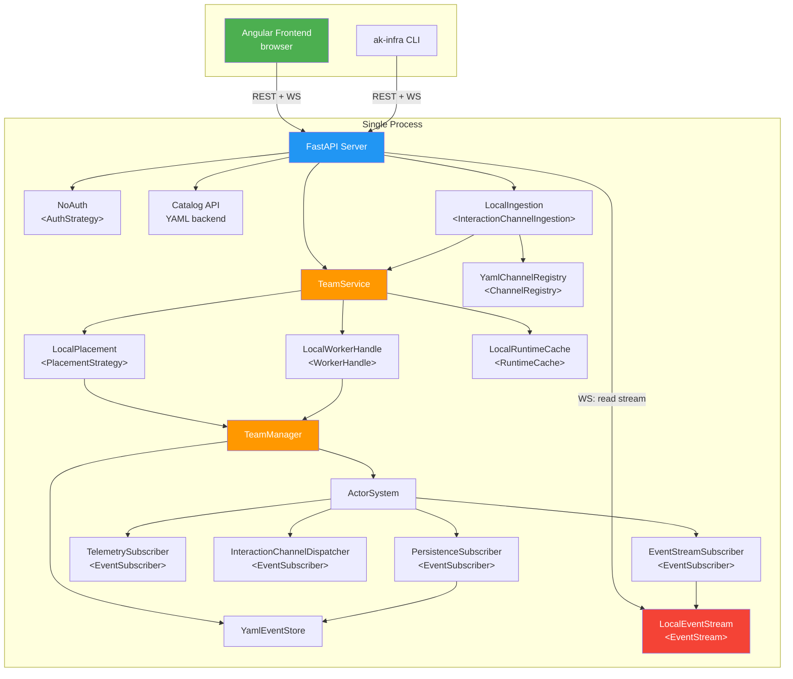
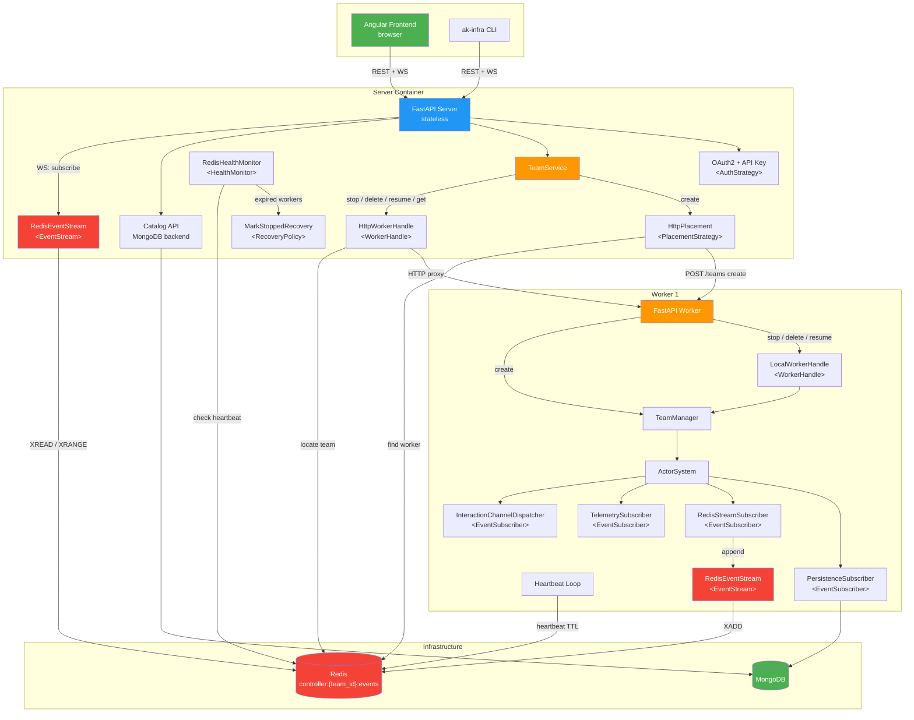
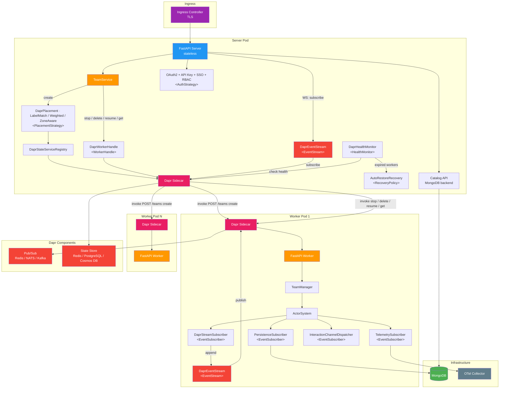

# akgentic-infra

**Status:** Beta — community tier complete; department and enterprise tiers implemented in the sibling `akgentic-infra-department` and `akgentic-infra-enterprise` packages.

## What is akgentic-infra?

Infrastructure backend for the Akgentic platform. It provides protocol abstractions that decouple the server and CLI from any specific deployment model, plus a complete set of community-tier implementations for single-process deployment. The department (`akgentic-infra-department`, Docker Compose) and enterprise (`akgentic-infra-enterprise`, Kubernetes/Dapr) tiers implement these same protocols for distributed deployment.

## Three-Tier Architecture

| Capability        | Community              | Department                    | Enterprise                         |
|-------------------|------------------------|-------------------------------|------------------------------------|
| Auth              | `NoAuth`               | OAuth2 + API key              | OAuth2 + API key + SSO + RBAC      |
| Placement         | `LocalPlacement`       | `HttpPlacement`               | `DaprPlacement` (LabelMatch → Weighted → ZoneAware) |
| Worker lifecycle  | `LocalWorkerHandle`    | `HttpWorkerHandle`            | `DaprWorkerHandle`                 |
| Team interaction  | `LocalTeamHandle`      | `HttpTeamHandle`              | `RemoteTeamHandle`                 |
| Runtime cache     | `LocalRuntimeCache`    | worker `LocalRuntimeCache` + server `HttpRuntimeCache` (no-op) | worker `LocalRuntimeCache` + server `RemoteRuntimeCache` (no-op) |
| Persistence       | `YamlEventStore`       | MongoDB                       | MongoDB + Dapr State               |
| Health monitoring | None (single process)  | `RedisHealthMonitor`          | `DaprHealthMonitor`                |
| Recovery          | None (single process)  | `MarkStoppedRecovery`         | `AutoRestoreRecovery` / `NotifyOnlyRecovery` |
| Channels          | `YamlChannelRegistry`  | `MongoChannelRegistry`        | `DaprChannelRegistry`              |
| Worker discovery  | N/A (same process)     | HTTP via Redis-registered URLs| Dapr service invocation            |
| Observability     | Logfire (direct)       | Logfire (direct)              | Logfire + OTel Collector           |
| Workspace storage | Local filesystem       | Docker named volume           | NFS / EFS                          |

### Community (single process)



### Department (Docker Compose)



### Enterprise (Kubernetes / Dapr)



## Source Layout

```
src/akgentic/infra/
  protocols/          Protocol definitions (the contracts)
    auth.py             AuthStrategy
    placement.py        PlacementStrategy
    worker_handle.py    WorkerHandle
    team_handle.py      TeamHandle
    runtime_cache.py    RuntimeCache
    channels.py         InteractionChannelAdapter, Ingestion, Parser, Registry
    health.py           HealthMonitor
    recovery.py         RecoveryPolicy
  adapters/           Protocol implementations
    community/          Single-process adapters (NoAuth, LocalPlacement, etc.)
    shared/             Tier-agnostic adapters (Telegram, telemetry, WebSocket)
  server/             FastAPI application
    routes/             REST, WebSocket, webhook, and frontend adapter routes
    services/           TeamService (tier-agnostic orchestrator)
    settings.py         Pydantic-settings configuration classes
    state_keys.py       Typed app.state key declarations (server tier)
    app.py              Application factory (create_app)
  cli/                Typer-based CLI (ak-infra)
  utils.py            StateKey[T] — typed app.state handle factory
  wiring.py           Dependency injection — wires adapters into services
  worker/             Worker module (planned for department/enterprise tiers)
    state_keys.py       Typed app.state key declarations (worker tier)
```

## Quick Start

**1. Start the server** (from the `akgentic-framework` root):

```python
# src/infra_server.py
from pathlib import Path
import uvicorn
from akgentic.infra.server.app import create_app
from akgentic.infra.server.settings import CommunitySettings
from akgentic.infra.wiring import wire_community

settings = CommunitySettings(catalog_path=Path("./src/catalog"))
services = wire_community(settings)
app = create_app(services, settings)

if __name__ == "__main__":
    uvicorn.run(app, host=settings.host, port=settings.port, timeout_graceful_shutdown=1)
```

```bash
python src/infra_server.py
```

**2. Connect with the CLI** (in a second terminal):

```bash
# Create a team from the catalog and open the chat TUI
ak-infra chat --create agent-team
```

## Protocols

These are the contracts that department/enterprise tiers must implement. All use structural subtyping (`typing.Protocol`) — no inheritance required.

The **Used in** column refers to the role in the distributed (department / enterprise) tiers; in the community tier the server and worker run in a single process.

| Protocol                       | File                | Abstracts                                     | Used in |
|--------------------------------|---------------------|-----------------------------------------------|---------|
| `PlacementStrategy`            | `placement.py`      | Worker selection and team creation             | Server |
| `WorkerHandle`                 | `worker_handle.py`  | Team stop / delete / resume / get             | Both — server-side remote handle delegates to the worker's local handle |
| `TeamHandle`                   | `team_handle.py`    | Send messages, route human input, subscribe   | Both — server-side remote handle delegates to the worker's local handle |
| `RuntimeCache`                 | `runtime_cache.py`  | Map team IDs to live TeamHandle instances      | Both — real cache on the worker, stateless no-op resolver on the server |
| `AuthStrategy`                 | `auth.py`           | Request authentication and user extraction     | Server |
| `InteractionChannelAdapter`    | `channels.py`       | Outbound message delivery to external channels | Worker — runs in the orchestrator's actor thread |
| `InteractionChannelIngestion`  | `channels.py`       | Inbound webhook routing to teams               | Server |
| `ChannelParser`                | `channels.py`       | Parse channel-specific webhook payloads        | Server |
| `ChannelRegistry`              | `channels.py`       | Map external channel users to active teams     | Server |
| `EventStream`                  | `event_stream.py`   | Tier-agnostic event streaming with replay and fan-out (ADR-010) | Both — worker appends, server reads / fans out |
| `StreamReader`                 | `event_stream.py`   | Cursor-based blocking reader for a team's event stream | Server — read side of the WebSocket fan-out |
| `HealthMonitor`                | `health.py`         | Worker liveness detection                      | Server |
| `RecoveryPolicy`               | `recovery.py`       | Recovery behavior on worker failure            | Server |

## Server Architecture

The server is built around a tier-agnostic `TeamService` that delegates all infrastructure concerns to protocol implementations. The `create_app()` factory wires everything together.

### REST API

| Method   | Path                            | Description                          |
|----------|---------------------------------|--------------------------------------|
| `POST`   | `/teams/`                       | Create a team from a catalog entry   |
| `GET`    | `/teams/`                       | List all teams                       |
| `GET`    | `/teams/{team_id}`              | Get team metadata                    |
| `DELETE` | `/teams/{team_id}`              | Stop and delete a team               |
| `POST`   | `/teams/{team_id}/message`      | Send a message to a running team     |
| `POST`   | `/teams/{team_id}/human-input`  | Provide human input to an agent      |
| `POST`   | `/teams/{team_id}/stop`         | Stop a team (preserve data)          |
| `POST`   | `/teams/{team_id}/restore`      | Restore a stopped team               |
| `GET`    | `/teams/{team_id}/events`       | Get persisted events                 |
| `GET`    | `/workspace/{team_id}/tree`     | List workspace files                 |
| `GET`    | `/workspace/{team_id}/file`     | Read a workspace file                |
| `POST`   | `/workspace/{team_id}/file`     | Upload a file to workspace           |
| `WS`     | `/ws/{team_id}`                 | Real-time event stream               |
| `POST`   | `/webhook/{channel}`            | Inbound channel webhook              |

Catalog endpoints are mounted under `/catalog/` and provided by `akgentic-catalog`.

### Frontend Adapter Plugin

An optional plugin system for translating API responses to legacy frontend formats. Configured via `AKGENTIC_FRONTEND_ADAPTER` (FQDN of the adapter class). When absent, the server serves the native V2 API only.

### Shared Adapters

Tier-agnostic adapters that work across community, department, and enterprise deployments:

| Adapter                      | Description                                                  |
|------------------------------|--------------------------------------------------------------|
| `InteractionChannelDispatcher` | Per-team outbound message dispatcher — routes `SentMessage` events to registered channel adapters |
| `TelegramChannelAdapter`     | Delivers outbound messages via the Telegram Bot API          |
| `TelegramChannelParser`      | Parses inbound Telegram webhook payloads                     |
| `ChannelParserRegistry`      | Resolves and holds channel parsers/adapters from config      |
| `EventStreamSubscriber`      | Event subscriber that routes orchestrator events to the team's `EventStream` |
| `RuntimeCacheEvictionSubscriber` | Event subscriber that evicts a stopped team's handle from the worker's `RuntimeCache` |
| `TelemetrySubscriber`        | Event subscriber that traces messages via Logfire            |

### Typed `app.state` access (`StateKey[T]`)

`create_app()` stores its wired services on FastAPI's `app.state` so routes can reach them. `app.state` is a `starlette.datastructures.State` whose attribute reads are typed `Any`, so routes used to `cast(...)` every read. `StateKey[T]` (see ADR-030 — Typed `app.state` Access via a `StateKey[T]` Registry) replaces that with a typed, serialization-free handle to one slot. The API is three calls:

- `KEY.set(source, value)` — the producer writes the slot.
- `KEY.get(source) -> T | None` — soft read; returns the key's `default` when the slot is unset (or raises `LookupError` if the key is `required=True`).
- `KEY.require(source) -> T` — loud read; never returns `None` (raises `LookupError` when unset/`None`).

`source` may be a `FastAPI`, `Request`, or `WebSocket`. A key is declared once as a module-level constant — that declaration *is* the registration; there is no central registry. `StateKey("name", *, default=..., required=...)` is the full constructor.

**Producer / consumer.** `create_app()` (the producer) sets each slot through its key, and routes (the consumers) read the same key handle:

```python
# producer — server/app.py
SERVICES.set(app, services)
TEAM_SERVICE.set(app, team_service)

# consumer — server/routes/teams.py
team_service = TEAM_SERVICE.require(request)
```

**Soft defaults.** A key declared with a `default` reads that default back when its slot was never set: `CHANNEL_PARSERS` and `FRONTEND_ADAPTER` default to `None`, `DRAINING` defaults to `False`. So `CHANNEL_PARSERS.get(request)` returns `ChannelParserRegistry | None` without any `getattr(..., None)` at the call site.

**`Depends` bridge.** DI-shaped handlers wrap the same key in a one-line provider — no second source of truth:

```python
def get_team_service(request: Request) -> TeamService:
    return TEAM_SERVICE.require(request)
```

**Key lives with its producer.** Server keys are declared in `server/state_keys.py`, worker keys in `worker/state_keys.py` — each in the package that writes the slot. Both tiers export a `SERVICES` key, but they are different keys typed to different containers (`TierServices` server-side, `WorkerServices` worker-side); the worker route imports its own (`from akgentic.infra.worker.state_keys import SERVICES`). Department and enterprise tiers adopt these keys on their own branches/PRs — a tracked follow-up (see `_bmad-output/akgentic-infra-department/migration-plan-lift-shared-auth-and-http-helpers-to-akgentic-infra.md`); the coexistence with the older `cast`/`getattr` style during that rollout is intentional.

## CLI

The `ak-infra` command provides a terminal interface to the server.

### Team management

```bash
ak-infra team list                      # List all teams
ak-infra team get <team_id>             # Show team detail
ak-infra team create <catalog_entry>    # Create a team
ak-infra team delete <team_id>          # Delete a team
ak-infra team restore <team_id>         # Restore a stopped team
ak-infra team events <team_id>          # Show team events
```

### Messaging

```bash
ak-infra message <team_id> <content>                    # Send a message
ak-infra reply <team_id> <content> --message-id <id>    # Reply to agent request
ak-infra chat [TEAM_ID]                                 # Interactive REPL
ak-infra chat --create <catalog_entry>                   # Create + chat
```

### Workspace

```bash
ak-infra workspace tree <team_id>                  # List files
ak-infra workspace read <team_id> <path>            # Read a file
ak-infra workspace upload <team_id> <local_path>    # Upload a file
```

### REPL Commands

Inside `ak-infra chat`, use `/` for slash commands:

| Command             | Description                    |
|---------------------|--------------------------------|
| `/help`             | Show available commands        |
| `/status`           | Show team status               |
| `/agents`           | List team agents               |
| `/history [N]`      | Show recent messages           |
| `/files`            | Show workspace files           |
| `/read <path>`      | Read a workspace file          |
| `/upload <path>`    | Upload a file                  |
| `/stop`             | Stop the team                  |
| `/restore`          | Restore a stopped team         |
| `/switch <team_id>` | Switch to another team         |

### Global Options

```bash
ak-infra --server http://localhost:8000   # Server URL (default)
ak-infra --api-key <key>                  # Credential for auth (see below)
ak-infra --format table|json              # Output format
```

`--api-key` accepts either credential type and routes it to the correct
header automatically: a structured API key (the `ak_<id>_<secret>` form
issued by `api-key bootstrap` / `POST /auth/apikeys`) is sent as
`X-API-Key`, while any other value is treated as a pre-resolved OIDC
bearer token and sent as `Authorization: Bearer`.

## Configuration

All settings are loaded from environment variables prefixed with `AKGENTIC_`.

### Server Settings (all tiers)

| Variable                       | Default       | Description                      |
|--------------------------------|---------------|----------------------------------|
| `AKGENTIC_HOST`                | `0.0.0.0`    | Bind address                     |
| `AKGENTIC_PORT`                | `8000`        | Port number                      |
| `AKGENTIC_LOG_LEVEL`           | `INFO`        | Log level (`DEBUG`, `INFO`, `WARNING`, `ERROR`, `CRITICAL`). Invalid values fall back to `INFO`. |
| `AKGENTIC_CORS_ORIGINS`        | `["*"]`       | Allowed CORS origins (JSON list) |
| `AKGENTIC_FRONTEND_ADAPTER`    | `None`        | Frontend adapter plugin FQDN     |

### Community Settings (extends server)

| Variable                       | Default        | Description                        |
|--------------------------------|----------------|------------------------------------|
| `AKGENTIC_WORKSPACES_ROOT`     | `workspaces`   | Root directory for team workspace storage |
| `AKGENTIC_EVENT_STORE_PATH`    | `data/event_store` | Root directory for event store persistence |
| `AKGENTIC_CATALOG_PATH`        | `data/catalog` | Catalog directory for team/agent/tool/template definitions |
| `AKGENTIC_CHANNEL_REGISTRY_PATH` | `None`      | Path to channel registry YAML; disabled when unset |

## Installation

### Within Monorepo Workspace

```bash
# From workspace root
source .venv/bin/activate

# Package is already installed in editable mode via workspace
# No additional installation needed
```

### Standalone Package

```bash
cd packages/akgentic-infra

uv venv
source .venv/bin/activate
uv pip install -e ".[dev]"
```

## Development

```bash
# Run all tests
pytest packages/akgentic-infra/tests/

# Run integration tests (requires API keys in .env)
pytest packages/akgentic-infra/tests/integration/ -m integration

# Type checking (strict mode)
mypy packages/akgentic-infra/src/

# Lint
ruff check packages/akgentic-infra/src/

# Format
ruff format packages/akgentic-infra/src/
```

Coverage target: **90%** (higher than other packages at 80%).

### Test Markers

| Marker          | Description                                                    |
|-----------------|----------------------------------------------------------------|
| `integration`   | Full server flow tests requiring real LLM and API keys         |
| `llm`           | Tests requiring LLM API keys (auto-skipped when `OPENAI_API_KEY` is absent) |
| `smoke`         | End-to-end smoke tests using `TestModel` (no API key required) |
| `e2e`           | Real end-to-end tests requiring a running server and `OPENAI_API_KEY` |

By default, `integration` tests are excluded (`-m 'not integration'`). Run them explicitly:

```bash
pytest packages/akgentic-infra/tests/ -m integration
```

## Dependencies

### Akgentic packages

`akgentic-core`, `akgentic-team`, `akgentic-catalog`, `akgentic-agent`, `akgentic-llm`, `akgentic-tool`

### Third-party

| Package             | Purpose                                |
|---------------------|----------------------------------------|
| `fastapi`           | HTTP server framework                  |
| `pydantic-settings` | Environment-based configuration        |
| `typer`             | CLI framework                          |
| `rich`              | Terminal rendering                     |
| `httpx`             | HTTP client (CLI to server)            |
| `websockets`        | WebSocket client and server            |
| `pyyaml`            | YAML persistence (event store, catalog)|
| `logfire`           | Observability and logging              |
