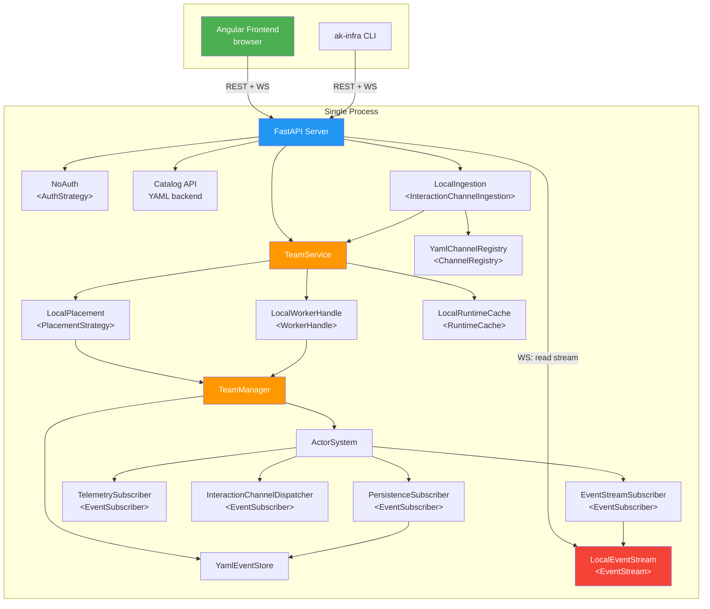
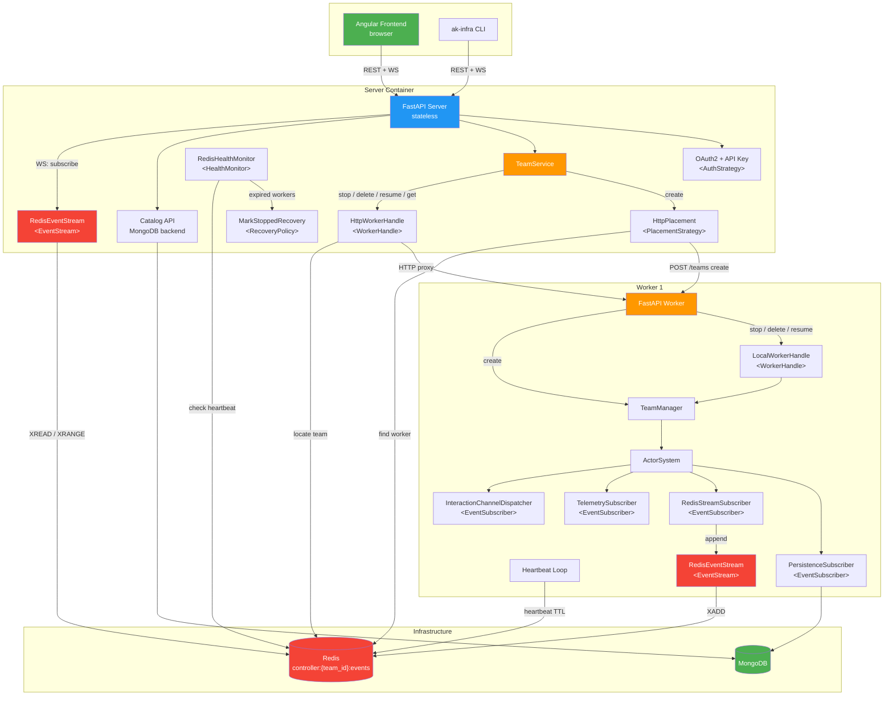
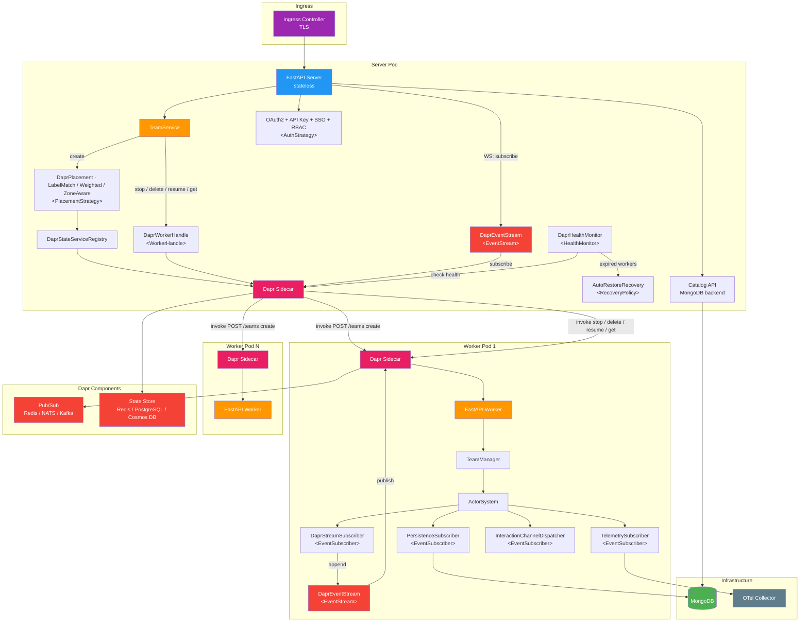

# akgentic-infra

[](https://github.com/b12consulting/akgentic-infra/actions/workflows/ci.yml)
[](https://github.com/b12consulting/akgentic-infra/actions/workflows/ci.yml)

**Status:** Beta — community tier complete; department and enterprise tiers implemented in the sibling `akgentic-infra-department` and `akgentic-infra-enterprise` packages.

## What is akgentic-infra?

Infrastructure backend for the [Akgentic](https://github.com/b12consulting/akgentic-framework) platform (open-source bundle). It provides protocol abstractions that decouple the server and CLI from any specific deployment model, plus a complete set of community-tier implementations for single-process deployment. The department (`akgentic-infra-department`, Docker Compose) and enterprise (`akgentic-infra-enterprise`, Kubernetes/Dapr) tiers implement these same protocols for distributed deployment.

## Three-Tier Architecture

| Capability        | Community              | Department                    | Enterprise                         |
|-------------------|------------------------|-------------------------------|------------------------------------|
| Auth              | `NoAuth` (anonymous)   | OAuth2 + API key              | OAuth2 + API key + SSO + RBAC      |
| Placement         | `LocalPlacement`       | `HttpPlacement`               | `DaprPlacement` (LabelMatch → Weighted → ZoneAware) |
| Worker lifecycle  | `LocalWorkerHandle`    | `HttpWorkerHandle`            | `DaprWorkerHandle`                 |
| Team interaction  | `LocalTeamHandle`      | `HttpTeamHandle`              | `RemoteTeamHandle`                 |
| Runtime cache     | `LocalRuntimeCache`    | worker `LocalRuntimeCache` + server `HttpRuntimeCache` (no-op) | worker `LocalRuntimeCache` + server `RemoteRuntimeCache` (no-op) |
| Persistence       | `YamlEventStore`       | MongoDB                       | MongoDB + Dapr State               |
| Health monitoring | None (single process)  | `RedisHealthMonitor`          | `DaprHealthMonitor`                |
| Recovery          | None (single process)  | `MarkStoppedRecovery`         | `AutoRestoreRecovery` / `NotifyOnlyRecovery` |
| Channels          | `YamlChannelRegistry`  | `MongoChannelRegistry`        | `DaprChannelRegistry`              |
| Worker discovery  | N/A (same process)     | HTTP via Redis-registered URLs| Dapr service invocation            |
| Observability     | Logfire (direct)       | Logfire (direct)              | Logfire + OTel Collector           |
| Workspace storage | Local filesystem       | Docker named volume           | NFS / EFS                          |

> **Auth row — one contract, per-tier dispatch.** The per-tier glosses above name only what differs (the *credential sources* a tier accepts). All three tiers implement the **same** async `AuthStrategy.resolve_request_user` contract that `akgentic-infra` owns; community's is a trivial anonymous resolver. The contract, the shared `RequireAuth` enforcement middleware, and the `require_team_access` resource-ownership gate are documented in [Authentication contract & enforcement](#authentication-contract--enforcement) (per ADR-034) — this README is the canonical source; department / enterprise docs point here.

### Community (single process)


```mermaid
graph TB
    subgraph "Single Process"
        API[FastAPI Server]
        SVC[TeamService]
        NA["NoAuth<br/>&lt;AuthStrategy&gt;"]
        CAT[Catalog API<br/>YAML backend]
        LP["LocalPlacement<br/>&lt;PlacementStrategy&gt;"]
        LWH["LocalWorkerHandle<br/>&lt;WorkerHandle&gt;"]
        LRC["LocalRuntimeCache<br/>&lt;RuntimeCache&gt;"]
        TM[TeamManager]
        AS[ActorSystem]
        YE[YamlEventStore]
        PS["PersistenceSubscriber<br/>&lt;EventSubscriber&gt;"]
        TS["TelemetrySubscriber<br/>&lt;EventSubscriber&gt;"]
        ICD["InteractionChannelDispatcher<br/>&lt;EventSubscriber&gt;"]
        ESS["EventStreamSubscriber<br/>&lt;EventSubscriber&gt;"]
        LES["LocalEventStream<br/>&lt;EventStream&gt;"]
        LI["LocalIngestion<br/>&lt;InteractionChannelIngestion&gt;"]
        YCR["YamlChannelRegistry<br/>&lt;ChannelRegistry&gt;"]
    end

    subgraph Clients [" "]
        direction LR
        FE[Angular Frontend<br/>browser]
        CLI[ak-infra CLI]
    end

    FE -->|REST + WS| API
    CLI -->|REST + WS| API
    API --> NA
    API --> SVC
    API --> CAT
    API --> LI
    API -->|WS: read stream| LES
    SVC --> LP
    SVC --> LWH
    SVC --> LRC
    LP --> TM
    LWH --> TM
    TM --> AS
    TM --> YE
    AS --> PS
    AS --> TS
    AS --> ICD
    AS --> ESS
    ESS --> LES
    PS --> YE
    LI --> SVC
    LI --> YCR

    style FE fill:#4CAF50,color:white
    style API fill:#2196F3,color:white
    style SVC fill:#FF9800,color:white
    style TM fill:#FF9800,color:white
    style LES fill:#F44336,color:white
```

### Department (Docker Compose)


```mermaid
graph TB
    subgraph Clients [" "]
        direction LR
        FE[Angular Frontend<br/>browser]
        CLI[ak-infra CLI]
    end

    subgraph "Server Container"
        SRV[FastAPI Server<br/>stateless]
        SVC_S[TeamService]
        AUTH["OAuth2 + API Key<br/>&lt;AuthStrategy&gt;"]
        PS_SRV["HttpPlacement<br/>&lt;PlacementStrategy&gt;"]
        HM["RedisHealthMonitor<br/>&lt;HealthMonitor&gt;"]
        RP["MarkStoppedRecovery<br/>&lt;RecoveryPolicy&gt;"]
        RWH["HttpWorkerHandle<br/>&lt;WorkerHandle&gt;"]
        RES_R["RedisEventStream<br/>&lt;EventStream&gt;"]
        CAT[Catalog API<br/>MongoDB backend]
    end

    subgraph "Worker 1"
        W1_API[FastAPI Worker]
        W1_LWH["LocalWorkerHandle<br/>&lt;WorkerHandle&gt;"]
        W1_TM[TeamManager]
        W1_AS[ActorSystem]
        W1_HB[Heartbeat Loop]
        W1_PS["PersistenceSubscriber<br/>&lt;EventSubscriber&gt;"]
        W1_RSS["RedisStreamSubscriber<br/>&lt;EventSubscriber&gt;"]
        W1_RES["RedisEventStream<br/>&lt;EventStream&gt;"]
        W1_TS["TelemetrySubscriber<br/>&lt;EventSubscriber&gt;"]
        W1_ICD["InteractionChannelDispatcher<br/>&lt;EventSubscriber&gt;"]
    end

    subgraph "Infrastructure"
        MONGO[(MongoDB)]
        REDIS[("Redis<br/>controller:{team_id}:events")]
    end

    %% Clients → Server
    FE -->|REST + WS| SRV
    CLI -->|REST + WS| SRV

    %% Server-internal wiring
    SRV --> AUTH
    SRV --> SVC_S
    SRV --> CAT
    SRV -->|WS: subscribe| RES_R
    SVC_S -->|create| PS_SRV
    SVC_S -->|stop / delete / resume / get| RWH
    HM -->|expired workers| RP

    %% Server → Worker
    PS_SRV -->|POST /teams create| W1_API
    RWH -->|HTTP proxy| W1_API

    %% Worker-internal wiring
    W1_API -->|stop / delete / resume| W1_LWH
    W1_API -->|create| W1_TM
    W1_LWH --> W1_TM
    W1_TM --> W1_AS
    W1_AS --> W1_PS
    W1_AS --> W1_RSS
    W1_AS --> W1_TS
    W1_AS --> W1_ICD
    W1_RSS -->|append| W1_RES

    %% → Infrastructure
    CAT --> MONGO
    W1_PS --> MONGO
    RES_R -->|XREAD / XRANGE| REDIS
    W1_RES -->|XADD| REDIS
    PS_SRV -->|find worker| REDIS
    RWH -->|locate team| REDIS
    HM -->|check heartbeat| REDIS
    W1_HB -->|heartbeat TTL| REDIS

    style FE fill:#4CAF50,color:white
    style SRV fill:#2196F3,color:white
    style SVC_S fill:#FF9800,color:white
    style W1_API fill:#FF9800,color:white
    style MONGO fill:#4CAF50,color:white
    style REDIS fill:#F44336,color:white
    style RES_R fill:#F44336,color:white
    style W1_RES fill:#F44336,color:white
```

### Enterprise (Kubernetes / Dapr)


```mermaid
graph TB
    subgraph "Ingress"
        ING[Ingress Controller<br/>TLS]
    end

    subgraph "Server Pod"
        SRV[FastAPI Server<br/>stateless]
        SVC_E[TeamService]
        AUTH["OAuth2 + API Key + SSO + RBAC<br/>&lt;AuthStrategy&gt;"]
        CAT[Catalog API<br/>MongoDB backend]
        PS_SRV["DaprPlacement · LabelMatch / Weighted / ZoneAware<br/>&lt;PlacementStrategy&gt;"]
        RWH_E["DaprWorkerHandle<br/>&lt;WorkerHandle&gt;"]
        DSR[DaprStateServiceRegistry]
        HM_E["DaprHealthMonitor<br/>&lt;HealthMonitor&gt;"]
        RP_E["AutoRestoreRecovery<br/>&lt;RecoveryPolicy&gt;"]
        DES_R["DaprEventStream<br/>&lt;EventStream&gt;"]
        SRV_DAPR[Dapr Sidecar]
    end

    subgraph "Worker Pod 1"
        W1_API[FastAPI Worker]
        W1_TM[TeamManager]
        W1_AS[ActorSystem]
        W1_PS["PersistenceSubscriber<br/>&lt;EventSubscriber&gt;"]
        W1_DSS["DaprStreamSubscriber<br/>&lt;EventSubscriber&gt;"]
        W1_DES["DaprEventStream<br/>&lt;EventStream&gt;"]
        W1_TS["TelemetrySubscriber<br/>&lt;EventSubscriber&gt;"]
        W1_ICD["InteractionChannelDispatcher<br/>&lt;EventSubscriber&gt;"]
        W1_DAPR[Dapr Sidecar]
    end

    subgraph "Worker Pod N"
        WN_API[FastAPI Worker]
        WN_DAPR[Dapr Sidecar]
    end

    subgraph "Infrastructure"
        MONGO[(MongoDB)]
        OTEL[OTel Collector]
    end

    subgraph "Dapr Components"
        PUBSUB["Pub/Sub<br/>Redis / NATS / Kafka"]
        STATE[State Store<br/>Redis / PostgreSQL / Cosmos DB]
    end

    ING --> SRV
    SRV --> AUTH
    SRV --> SVC_E
    SRV --> CAT
    SVC_E -->|create| PS_SRV
    SVC_E -->|stop / delete / resume / get| RWH_E
    PS_SRV --> DSR
    DSR --> SRV_DAPR
    RWH_E --> SRV_DAPR
    SRV_DAPR -->|invoke POST /teams create| W1_DAPR
    SRV_DAPR -->|invoke POST /teams create| WN_DAPR
    SRV_DAPR -->|invoke stop / delete / resume / get| W1_DAPR
    SRV_DAPR --> STATE
    SRV -->|WS: subscribe| DES_R
    DES_R -->|subscribe| SRV_DAPR
    HM_E -->|check health| SRV_DAPR
    HM_E -->|expired workers| RP_E
    W1_DAPR --> W1_API
    WN_DAPR --> WN_API
    W1_API --> W1_TM
    W1_TM --> W1_AS
    W1_AS --> W1_PS
    W1_AS --> W1_DSS
    W1_AS --> W1_TS
    W1_AS --> W1_ICD
    W1_PS --> MONGO
    W1_DSS -->|append| W1_DES
    W1_DES -->|publish| W1_DAPR
    W1_DAPR --> PUBSUB
    W1_TS --> OTEL
    CAT --> MONGO

    style ING fill:#9C27B0,color:white
    style SRV fill:#2196F3,color:white
    style SVC_E fill:#FF9800,color:white
    style W1_API fill:#FF9800,color:white
    style WN_API fill:#FF9800,color:white
    style MONGO fill:#4CAF50,color:white
    style PUBSUB fill:#F44336,color:white
    style STATE fill:#F44336,color:white
    style DES_R fill:#F44336,color:white
    style W1_DES fill:#F44336,color:white
    style OTEL fill:#607D8B,color:white
    style SRV_DAPR fill:#E91E63,color:white
    style W1_DAPR fill:#E91E63,color:white
    style WN_DAPR fill:#E91E63,color:white
```

## Source Layout

```
src/akgentic/infra/
  protocols/          Protocol definitions (the contracts)
    auth.py             AuthStrategy
    placement.py        PlacementStrategy
    worker_handle.py    WorkerHandle
    team_handle.py      TeamHandle
    runtime_cache.py    RuntimeCache
    channels.py         InteractionChannelAdapter, Ingestion, Parser, Registry
    health.py           HealthMonitor
    recovery.py         RecoveryPolicy
  adapters/           Protocol implementations
    community/          Single-process adapters (NoAuth, LocalPlacement, etc.)
    shared/             Tier-agnostic adapters (Telegram, telemetry, WebSocket)
  server/             FastAPI application
    routes/             REST, WebSocket, and webhook routes
    services/           TeamService (tier-agnostic orchestrator)
    settings.py         Pydantic-settings configuration classes
    state_keys.py       Typed app.state key declarations (server tier)
    app.py              Application factory (create_app)
  cli/                Typer-based CLI (ak-infra)
  utils.py            StateKey[T] — typed app.state handle factory
  wiring.py           Dependency injection — wires adapters into services
  worker/             Worker module (planned for department/enterprise tiers)
    state_keys.py       Typed app.state key declarations (worker tier)
```

## Quick Start

**1. Start the server** (from the `akgentic-framework` root):

```python
# src/infra_server.py
from pathlib import Path
import uvicorn
from akgentic.infra.server.app import create_app
from akgentic.infra.server.settings import CommunitySettings
from akgentic.infra.wiring import wire_community

settings = CommunitySettings(catalog_path=Path("./src/catalog"))
services = wire_community(settings)
app = create_app(services, settings)

if __name__ == "__main__":
    uvicorn.run(app, host=settings.host, port=settings.port, timeout_graceful_shutdown=1)
```

```bash
python src/infra_server.py
```

**2. Connect with the CLI** (in a second terminal):

```bash
# Create a team from the catalog and open the chat TUI
ak-infra chat --create agent-team
```

## Protocols

These are the contracts that department/enterprise tiers must implement. All use structural subtyping (`typing.Protocol`) — no inheritance required.

The **Used in** column refers to the role in the distributed (department / enterprise) tiers; in the community tier the server and worker run in a single process.

| Protocol                       | File                | Abstracts                                     | Used in |
|--------------------------------|---------------------|-----------------------------------------------|---------|
| `PlacementStrategy`            | `placement.py`      | Worker selection and team creation             | Server |
| `WorkerHandle`                 | `worker_handle.py`  | Team stop / delete / resume / get             | Both — server-side remote handle delegates to the worker's local handle |
| `TeamHandle`                   | `team_handle.py`    | Send messages, route human input, subscribe   | Both — server-side remote handle delegates to the worker's local handle |
| `RuntimeCache`                 | `runtime_cache.py`  | Map team IDs to live TeamHandle instances      | Both — real cache on the worker, stateless no-op resolver on the server |
| `AuthStrategy`                 | `auth.py`           | Async `resolve_request_user(connection) -> RequestUser` (raises 401) + `get_auth_routes` — see [Authentication contract & enforcement](#authentication-contract--enforcement) | Server |
| `InteractionChannelAdapter`    | `channels.py`       | Outbound message delivery to external channels | Worker — runs in the orchestrator's actor thread |
| `InteractionChannelIngestion`  | `channels.py`       | Inbound webhook routing to teams               | Server |
| `ChannelParser`                | `channels.py`       | Parse channel-specific webhook payloads        | Server |
| `ChannelRegistry`              | `channels.py`       | Map external channel users to active teams     | Server |
| `EventStream`                  | `event_stream.py`   | Tier-agnostic event streaming with replay and fan-out (ADR-010) | Both — worker appends, server reads / fans out |
| `StreamReader`                 | `event_stream.py`   | Cursor-based blocking reader for a team's event stream | Server — read side of the WebSocket fan-out |
| `HealthMonitor`                | `health.py`         | Worker liveness detection                      | Server |
| `RecoveryPolicy`               | `recovery.py`       | Recovery behavior on worker failure            | Server |

## Server Architecture

The server is built around a tier-agnostic `TeamService` that delegates all infrastructure concerns to protocol implementations. The `create_app()` factory wires everything together.

### REST API

| Method   | Path                            | Description                          |
|----------|---------------------------------|--------------------------------------|
| `POST`   | `/teams/`                       | Create a team from a catalog entry   |
| `GET`    | `/teams/`                       | List all teams — accepts `?meta.<key>=<value>` metadata filters |
| `GET`    | `/teams/{team_id}`              | Get team metadata                    |
| `DELETE` | `/teams/{team_id}`              | Stop and delete a team               |
| `PATCH`  | `/teams/{team_id}/metadata`     | Replace a team's business metadata   |
| `POST`   | `/teams/{team_id}/message`      | Send a message to a running team     |
| `POST`   | `/teams/{team_id}/human-input`  | Provide human input to an agent      |
| `POST`   | `/teams/{team_id}/stop`         | Stop a team (preserve data)          |
| `POST`   | `/teams/{team_id}/restore`      | Restore a stopped team               |
| `GET`    | `/teams/{team_id}/events`       | Get persisted events                 |
| `GET`    | `/workspace/{team_id}/tree`     | List workspace files                 |
| `GET`    | `/workspace/{team_id}/file`     | Read a workspace file                |
| `POST`   | `/workspace/{team_id}/file`     | Upload a file to workspace           |
| `WS`     | `/ws/{team_id}`                 | Real-time event stream               |
| `POST`   | `/webhook/{channel}`            | Inbound channel webhook              |

Catalog endpoints are mounted under `/catalog/` and provided by `akgentic-catalog`.

### Team metadata

A team can carry **business metadata** — a small typed document (`{"tenant": "acme", "case_ref": "C-1234"}`) that the deployment defines, the server validates, and callers filter teams by. Three surfaces cover it: `POST /teams` sets it at creation, `GET /teams?meta.<key>=<value>` filters on it, and `PATCH /teams/{team_id}/metadata` replaces it.

Two rules govern all three, and neither is guessable from the endpoint shapes:

- **Metadata is plain JSON, and the client never names its type.** The server resolves the validating type itself, from the team's `catalog_namespace` → `TeamCard.metadata_type`. A `__model__` key anywhere in a metadata body is a **422** — not a hint the server follows, and not silently dropped. This is deliberately unlike `SendMessageRequest.message` / `EmitMessageRequest.message`, which *are* `__model__`-tagged wire envelopes.
- **Metadata filters are equality-only and AND-combined.** No ranges, no prefix or substring matching, no sort-by-metadata. Multiple `meta.` parameters only ever narrow the result set.

Responses carry the metadata as plain JSON too, with the `__model__` tag stripped — so a document read from a response can be sent straight back on a create or an update.

**Create a team with metadata.**

```http
POST /teams
Content-Type: application/json

{
  "catalog_namespace": "acme-support",
  "metadata": {"tenant": "acme", "case_ref": "C-1234"}
}
```

```http
201 Created

{
  "team_id": "6f1e8c4a-...",
  "name": "acme-support",
  "status": "running",
  "user_id": "anonymous",
  "created_at": "2026-08-11T09:00:00Z",
  "updated_at": "2026-08-11T09:00:00Z",
  "metadata": {"tenant": "acme", "case_ref": "C-1234"}
}
```

`metadata` is optional; omitting it, or sending `null` or `{}`, creates a team carrying none. Validation runs *before* the team is placed, so a rejected body creates nothing. Every route returning a team — `POST /teams`, `GET /teams`, `GET /teams/{team_id}`, `POST /teams/{team_id}/restore` — carries the same `metadata` field.

The three rejections, each a `422` with the message in `detail`:

| Condition | `detail` |
|---|---|
| Body carries `__model__` at any depth | `metadata must not contain a '__model__' key at any depth: the metadata type is chosen by the team's catalog entry, never by the request body` |
| **Non-empty** metadata sent to a team whose card declares no `metadata_type` | `this team declares no metadata contract, so metadata cannot be supplied` |
| Body fails the declared schema | `metadata field '<field>' is invalid: <reason>` |

An unknown `catalog_namespace` is a `404` (`Catalog namespace not found`).

**Filter teams by metadata.** Repeated `?meta.<key>=<value>` parameters add equality filters, AND-combined across distinct keys, on top of the existing `status` and pagination parameters:

```http
GET /teams?meta.tenant=acme
GET /teams?meta.tenant=acme&meta.case_ref=C-1234
GET /teams?meta.tenant=acme&status=running&page=1&size=250
```

```http
200 OK

{
  "teams": [
    {
      "team_id": "6f1e8c4a-...",
      "name": "acme-support",
      "status": "running",
      "user_id": "anonymous",
      "created_at": "2026-08-11T09:00:00Z",
      "updated_at": "2026-08-11T09:00:00Z",
      "metadata": {"tenant": "acme", "case_ref": "C-1234"}
    }
  ],
  "total_count": 1
}
```

`total_count` is the **filtered** total — the number of the caller's teams matching every filter given, not their unfiltered team count — and it stays consistent across page boundaries. Owner scoping is server-side and no filter weakens it: a `meta.` parameter can only narrow the caller's own teams, and another user's team is neither returned nor counted.

A filter narrows the *result set*, not the per-page cost: the store returns every matching row and the page is sorted and sliced in the server, so a request still costs in proportion to the number of matching teams rather than to `size`.

Values travel verbatim; the server escapes the index separator, so a value containing `|` needs nothing from the client. Filtering on a key the metadata model does not mark as indexed is not an error — it simply matches nothing. Two `422`s guard the parameter itself: `?meta.=x` (`query parameter 'meta.' names no metadata key`) and the same key given twice (`query parameter 'meta.tenant' is repeated; metadata filtering is equality-only, so one key cannot carry two values`).

**Replace a team's metadata.** `PATCH` takes a `metadata` envelope and **replaces the stored document outright — it does not merge**. The caller sends a complete document; a field omitted from it is gone, both from the stored value and from the `meta.` filter index. An empty object clears the metadata, and the response then reads `{"metadata": null}` — a cleared team carries `null`, never `{}`. Clearing is the one body an otherwise-rejecting team accepts: `{"metadata": {}}` succeeds even on a team whose card declares no `metadata_type`.

```http
PATCH /teams/6f1e8c4a-.../metadata
Content-Type: application/json

{"metadata": {"tenant": "contoso", "case_ref": "C-9999"}}
```

```http
200 OK

{"metadata": {"tenant": "contoso", "case_ref": "C-9999"}}
```

The response body carries what was persisted. The same three `422`s apply. A team that does not exist and a team belonging to another user are both `404` (`Team not found`) — `require_team_access` answers 404-over-403 so the API leaks no team-existence signal. Note the envelope: `PATCH` wraps the document under a required `metadata` key (a bare `{"tenant": "contoso"}` body is a `422`), whereas `TeamResponse.metadata` carries the document directly.

The write is database-first, then a best-effort push to the live team; a `200` means the system of record was updated, so a subsequent `GET /teams?meta.<key>=<new-value>` finds the team.

### Team metadata on the worker surface

Everything above is the **server** API. In the department and enterprise tiers the server does not own the running team — a worker does — so the server forwards team *operations* to the worker that holds it. This section is that internal hop. **If you are writing an application client, you want the server routes above; this surface is for the tiers' `WorkerHandle` adapters.** Workers are never publicly routed (see *Server ↔ Worker Auth* in the architecture docs). In the community tier there is no hop at all: `LocalWorkerHandle` calls `TeamManager` in-process, so nothing here is on the path.

The worker's team routes (`worker/routes/teams.py`):

| Method   | Path                                                   | Returns                                   |
|----------|--------------------------------------------------------|-------------------------------------------|
| `POST`   | `/teams`                                               | `201` `TeamResponse`                      |
| `POST`   | `/teams/{team_id}/message`                             | `204`                                     |
| `POST`   | `/teams/{team_id}/message/{agent_name}`                | `204`                                     |
| `POST`   | `/teams/{team_id}/message/from/{sender}/to/{recipient}`| `204`                                     |
| `POST`   | `/teams/{team_id}/notification`                        | `204`                                     |
| `POST`   | `/teams/{team_id}/human-input`                         | `204`                                     |
| `POST`   | `/teams/{team_id}/stop`                                | `204`                                     |
| `DELETE` | `/teams/{team_id}`                                     | `204`                                     |
| `PATCH`  | `/teams/{team_id}/metadata`                            | `200` **the persisted `Process`**         |
| `POST`   | `/teams/{team_id}/resume`                              | `200` `TeamResponse`                      |

**Verbs on the live actor go to the worker. Reads of persisted state do not.**

That is the rule, and it is what the table above is shaped by. Stopping, resuming, messaging, routing human input and replacing metadata are real work only the owning worker can do — it holds the live orchestrator. A read is a lookup, and the event store already answers it, so all three tiers read `EventStore.load_team()` directly.

The worked example: the worker **used to** expose a `GET /teams/{team_id}`. No tier ever called it, and it was deleted. Two reasons it could not be used, and both generalize to any read route proposed here — it returned a flat `TeamResponse` with no `team_card`, so it could not satisfy `WorkerHandle.get_team(...) -> Process | None`, which needs the card for resume; and routing a read through a worker lets a momentarily-unreachable worker turn a transient network fault into a spurious `404` for a team that plainly exists. Adding a read route back "for symmetry" reintroduces both.

**The worker revalidates metadata. It does not trust the server's word.**

Both metadata-carrying worker routes run the *same* validation the server just ran. This is not belt-and-braces, and the reason is reachability rather than redundancy: **a worker is reachable by anything holding its address.** The server-side check protects the server's callers and says nothing about who else can reach this route. "The server already checked" is a *deployment assumption* — workers are internal-only — and a deployment assumption is not a security property; it holds until a network policy changes.

It costs nothing to hold: the worker already has the resolved `team_card`, so it knows `metadata_type` without a catalog lookup. And it is the **same shared helper** (`server/services/_metadata_payload.py`), called from both surfaces — not a second copy. Do not "deduplicate" one call site away: two validators drift, and this one is a security control.

**Create.** `WorkerCreateTeamRequest` carries `metadata` as a top-level field of plain JSON, exactly as the server's `CreateTeamRequest` does:

```http
POST /teams
Content-Type: application/json

{
  "team_card": {"...": "pre-resolved by the server"},
  "user_id": "u-42",
  "user_email": "ops@contoso.example",
  "metadata": {"tenant": "acme", "case_ref": "C-1234"}
}
```

The `201` body is a `TeamResponse` whose `metadata` is plain JSON with the `__model__` tag stripped. Validation runs **before** anything is created, so a rejected body creates nothing — no team, no cached handle.

**Replace metadata.** `PATCH` takes the same `{"metadata": {...}}` envelope as the server's, validated against the `metadata_type` the **persisted** card declares (never a fresh catalog lookup — the type cannot change for a live team, and re-resolving would let a catalog edit silently change what an existing team accepts). It replaces outright and does not merge.

```http
PATCH /teams/6f1e8c4a-.../metadata
Content-Type: application/json

{"metadata": {"tenant": "contoso", "case_ref": "C-9999"}}
```

```http
200 OK

{
  "__model__": "akgentic.team.models.Process",
  "team_id": "6f1e8c4a-...",
  "team_card": {"...": "the persisted card"},
  "status": "running",
  "user_id": "u-42",
  "metadata": {"__model__": "acme.models.CaseMetadata",
               "tenant": "contoso", "case_ref": "C-9999"},
  "metadata_indexes": ["tenant|contoso", "case_ref|C-9999"]
}
```

**Read the stored value off that response; do not echo what you sent.** The write path re-derives `metadata_indexes` from the new document, and this response is the *only* place that re-derivation becomes observable to the caller. A caller that echoes its own request body reports an index that may not exist.

Note what the response is **not**: not a `TeamResponse` (flat, no `team_card`, no `metadata_indexes`) and not the server's `TeamMetadataResponse`. It is the full persisted `Process`, and its `__model__` tags are **left intact** — the one place in this surface where they are. That is deliberate and structural: this is a worker→server internal hop, not a client response, and the tag is precisely what lets a tier adapter reconstruct a typed `Process` — including a `metadata` value of the team's concrete declared class — to satisfy `WorkerHandle.update_team_metadata(...) -> Process`. Strip it for consistency and the caller has nothing to reconstruct from.

A **failed** best-effort push to the live orchestrator still returns `200`. The database is the system of record and the actor re-reads on its next resume, so reporting an error would misdescribe a write that stands.

**`__model__`, in both directions.** Metadata is plain JSON on the wire here exactly as on the server surface: a `__model__` key at any depth in a request body is a **422**, and outbound values are stripped, so a document read from a worker response can be sent straight back. The scan runs **first and unconditionally** — so a tagged body sent to a team whose card declares no `metadata_type` is answered with the `__model__` reason, not the misleading "this team takes no metadata". The `PATCH` **response** above is the single exception, for the reason given there.

The rejections are the server's three `422`s, verbatim, on both worker routes:

| Condition | `detail` |
|---|---|
| Body carries `__model__` at any depth | `metadata must not contain a '__model__' key at any depth: the metadata type is chosen by the team's catalog entry, never by the request body` |
| **Non-empty** metadata sent to a team whose card declares no `metadata_type` | `this team declares no metadata contract, so metadata cannot be supplied` |
| Body fails the declared schema | `metadata field '<field>' is invalid: <reason>` |

An **empty document is not an error** — it clears. Absent, `null` or `{}` all mean "no metadata", and because the emptiness check runs *before* the contract check, `{"metadata": {}}` succeeds even for a team whose card declares no `metadata_type`. That ordering is what keeps the carve-out from contradicting the second row above.

`PATCH` answers `404` for an unknown or deleted `team_id`. Lifecycle failures map through the module's shared error mapper (`404` for not-found/deleted, `409` otherwise); the validation `422`s deliberately bypass it, since its string match would report a validation failure as a conflict.

### Authentication contract & enforcement

Authentication is **one tier-agnostic contract** that `akgentic-infra` owns, plus a shared enforcement mechanism the tiers compose. Per ADR-034 (`_bmad-output/akgentic-infra/decisions/adr-034-tier-agnostic-auth-contract.md` — its current-vs-Design-D diagrams show the before/after assembly, the one-contract/one-mechanism target, the twice-vs-once request flow, and the ownership table), a tier no longer hand-wires its own copy of the auth assembly; it implements the resolver and composes the building block.

**The contract — `AuthStrategy` (`protocols/auth.py`).** A `@runtime_checkable` Protocol with one async resolver:

```python
async def resolve_request_user(self, connection: HTTPConnection) -> RequestUser: ...  # raises HTTPException(401)
def get_auth_routes(self) -> list[BaseRoute]: ...                                      # community returns []
```

The boundary speaks the **neutral infra `RequestUser`** (`{user_id, email, roles}`, `server/auth.py`); a tier's richer identity type (e.g. an `AuthenticatedUser` carrying `name`/`auth_method`) is projected to `RequestUser` **inside** the resolver, not at a separate per-tier seam. The contract is **async-native** — there is no synchronous entry point (removed in Story 40.1). A tier that fails to implement the resolver fails `isinstance(..., AuthStrategy)` and the shared contract test, so the half-wiring that produced the enterprise `/admin/catalog/*` 401 becomes structurally impossible to ship silently.

**The shared `RequireAuth` building block (`server/middleware/require_auth.py`).** One ASGI middleware (`RequireAuthMiddleware`) that, per non-`OPTIONS` / non-allowlisted `http`/`websocket` scope:

1. awaits `services.auth.resolve_request_user(connection)` **exactly once**,
2. stashes the resolved `RequestUser` on `request.state.request_user` (the same stash the gate, the caller-identity scope, and the mutation-log audit all read), and
3. on a raising resolver, rejects **pre-routing** — WebSocket close `1008`, else a `JSONResponse` 401.

It is parameterized by the allowlists the tier supplies: `exact_allowlist` (default `frozenset({"/readiness"})`) and `prefix_allowlist` (default `("/auth/",)`).

**Override seam (bounded extensibility).** The block is pluggable at the edges only:

- `requires_principal(connection) -> bool` — a tier predicate (richer than the static allowlists) that exempts paths authenticated by a *different* mechanism (e.g. an HMAC-verified signed-webhook or Dapr fan-out path) without treating them as anonymous.
- `on_reject(connection, exc) -> Response` — the tier shapes its own HTTP 401 (JSON vs redirect-to-login, `WWW-Authenticate` header, etc.). The WebSocket `1008` close is fixed.
- **Guarded escape hatch** — a tier MAY supply a wholly custom middleware **only if** it passes the shared stash-contract test (resolve once → stash `request.state.request_user` → 401-on-raise pre-routing).

The load-bearing invariant — **resolve-once + stash key + 401-on-raise pre-routing** — is **never** overridable; only the edges are.

**The seam reads the stash; the gate is unchanged.** `get_request_user` (`server/auth.py`) returns the stashed `RequestUser` when the middleware populated it, else the community anonymous default (`RequestUser(user_id="anonymous")` — never `None`, never raises). Auth therefore runs **once per request**, not twice. The catalog gate `require_authenticated_principal` keeps `Depends(get_request_user)` and **still never 401s on its own** — the strategy raises 401, the shared middleware is the pre-routing 401 path.

**`require_team_access` — resource-ownership authorization (`server/routes/_team_access.py`).** A per-route `Depends` (authorization, *not* authentication — middleware has no route/param knowledge) that resolves the team `Process` by `team_id` via the team-access seam (`get_team_service` → `TeamService.get_team`) and allows iff `process.user_id == principal.user_id` **OR** `"admin" in principal.roles`; otherwise it raises **404** (404-over-403 — no existence leak). It is mounted on the per-`team_id` routes (`GET`/`DELETE /teams/{id}`, `POST /teams/{id}/message`, `GET /teams/{id}/events`) and mirrors ADR-028's `require_namespace_owner_or_admin`. The check and the team-access seam are **infra-owned**; the RBAC role *vocabulary* and enterprise's tenant intersection stay tier-side.

**Per-tier wiring (infra-owned vs tier-owned).**

| Tier | Resolver | Middleware |
|---|---|---|
| Community (`NoAuth`) | trivial anonymous — returns `RequestUser(user_id="anonymous")`, never raises; `get_auth_routes` → `[]` | mounts **none** (nothing to enforce) — behaviour byte-unchanged |
| Department | implements `resolve_request_user` (its credential dispatch, projecting to `RequestUser`) | composes the shared `RequireAuth` block into its own stack with its own allowlists |
| Enterprise | implements `resolve_request_user` (its credential dispatch + tenant scoping) | composes the shared `RequireAuth` block into its own stack with its own allowlists |

**Infra owns** the `AuthStrategy` contract, the `RequireAuth` building block, the stash + `get_request_user` seam, and `require_team_access`. **Tiers own** their credential dispatch (which sources, in what priority), their middleware-stack composition / layer ordering, their allowlist *contents*, and their RBAC role vocabulary. Department / enterprise document only their own composition and allowlists; they point here for the contract.

**Running with real authentication (licensed).** The community tier ships anonymous (`auth_strategy="noauth"`, the default). To run it with real auth, install `akgentic-infra-auth` — a **separately-licensed, non-open-source** plugin — into the same environment as `akgentic-infra` from a private index, direct URL, or vendored wheel (**not** public PyPI, and **not** an `akgentic-infra[auth]` extra — infra's public metadata never names the private package). The plugin registers a **zero-argument factory** under the `akgentic.infra.auth.strategies` entry-point group; the operator then sets `auth_strategy="oidc"` (the plugin's registered name). The factory reads its **own** configuration (OIDC issuer, client id/secret, backing-store connection strings) — infra passes it **no arguments**, and `CommunitySettings` carries only the selector string, never auth-provider fields. Resolution is **fail-closed**: until the plugin registers its entry point, any non-`"noauth"` selector fails loud at wire time (`UnknownAuthStrategyError`, empty discoverable list) — never a silent anonymous fallback. So the community + real-auth path is present but becomes *operational* only once the licensed plugin registers that entry point (a separate `akgentic-infra-auth` follow-up). See ADR-037.

**Namespace proximity — `akgentic.infra.auth` is the plugin's, not infra's.** The plugin's `akgentic.infra.auth` namespace merges into infra's shared `akgentic.infra.*` namespace via `pkgutil.extend_path`, so it sits **beside** the infra-owned `akgentic.infra.server.auth` and `akgentic.infra.protocols.auth` — but it is **not** infra-owned. Infra does not depend on, import, or ship the plugin; the entry-point group is the only seam between them.

### Frontend Adapter Plugin (removed)

The V1 frontend-adapter plugin system was removed — the Angular frontend consumes the native V2 API directly; see the modular app assembly decision record (`_bmad-output/akgentic-infra/decisions/adr-039-modular-app-assembly-appmodule-contract.md`).

### Shared Adapters

Tier-agnostic adapters that work across community, department, and enterprise deployments:

| Adapter                      | Description                                                  |
|------------------------------|--------------------------------------------------------------|
| `InteractionChannelDispatcher` | Per-team outbound message dispatcher — routes `SentMessage` events to registered channel adapters |
| `TelegramChannelAdapter`     | Delivers outbound messages via the Telegram Bot API          |
| `TelegramChannelParser`      | Parses inbound Telegram webhook payloads                     |
| `ChannelParserRegistry`      | Resolves and holds channel parsers/adapters from config      |
| `EventStreamSubscriber`      | Event subscriber that routes orchestrator events to the team's `EventStream` |
| `RuntimeCacheEvictionSubscriber` | Event subscriber that evicts a stopped team's handle from the worker's `RuntimeCache` |
| `TelemetrySubscriber`        | Event subscriber that traces messages via Logfire            |

### Typed `app.state` access (`StateKey[T]`)

`create_app()` stores its wired services on FastAPI's `app.state` so routes can reach them. `app.state` is a `starlette.datastructures.State` whose attribute reads are typed `Any`, so routes used to `cast(...)` every read. `StateKey[T]` (see ADR-030 — Typed `app.state` Access via a `StateKey[T]` Registry) replaces that with a typed, serialization-free handle to one slot. The API is three calls:

- `KEY.set(source, value)` — the producer writes the slot.
- `KEY.get(source) -> T | None` — soft read; returns the key's `default` when the slot is unset (or raises `LookupError` if the key is `required=True`).
- `KEY.require(source) -> T` — loud read; never returns `None` (raises `LookupError` when unset/`None`).

`source` may be a `FastAPI`, `Request`, or `WebSocket`. A key is declared once as a module-level constant — that declaration *is* the registration; there is no central registry. `StateKey("name", *, default=..., required=...)` is the full constructor.

**Producer / consumer.** `create_app()` (the producer) sets each slot through its key, and routes (the consumers) read the same key handle:

```python
# producer — server/app.py
SERVICES.set(app, services)
TEAM_SERVICE.set(app, team_service)

# consumer — server/routes/teams.py
team_service = TEAM_SERVICE.require(request)
```

**Soft defaults.** A key declared with a `default` reads that default back when its slot was never set: `CHANNEL_PARSERS` defaults to `None`, `DRAINING` defaults to `False`. So `CHANNEL_PARSERS.get(request)` returns `ChannelParserRegistry | None` without any `getattr(..., None)` at the call site.

**`Depends` bridge.** DI-shaped handlers wrap the same key in a one-line provider — no second source of truth:

```python
def get_team_service(request: Request) -> TeamService:
    return TEAM_SERVICE.require(request)
```

**Key lives with its producer.** Server keys are declared in `server/state_keys.py`, worker keys in `worker/state_keys.py` — each in the package that writes the slot. Both tiers export a `SERVICES` key, but they are different keys typed to different containers (`TierServices` server-side, `WorkerServices` worker-side); the worker route imports its own (`from akgentic.infra.worker.state_keys import SERVICES`). Department and enterprise tiers adopt these keys on their own branches/PRs — a tracked follow-up (see `_bmad-output/akgentic-infra-department/migration-plan-lift-shared-auth-and-http-helpers-to-akgentic-infra.md`); the coexistence with the older `cast`/`getattr` style during that rollout is intentional.

## CLI

The `ak-infra` command provides a terminal interface to the server.

### Team management

```bash
ak-infra team list                      # List all teams
ak-infra team get <team_id>             # Show team detail
ak-infra team create <catalog_entry>    # Create a team
ak-infra team delete <team_id>          # Delete a team
ak-infra team restore <team_id>         # Restore a stopped team
ak-infra team events <team_id>          # Show team events
```

### Messaging

```bash
ak-infra message <team_id> <content>                    # Send a message
ak-infra reply <team_id> <content> --message-id <id>    # Reply to agent request
ak-infra chat [TEAM_ID]                                 # Interactive REPL
ak-infra chat --create <catalog_entry>                   # Create + chat
```

### Workspace

```bash
ak-infra workspace tree <team_id>                  # List files
ak-infra workspace read <team_id> <path>            # Read a file
ak-infra workspace upload <team_id> <local_path>    # Upload a file
```

### REPL Commands

Inside `ak-infra chat`, use `/` for slash commands:

| Command             | Description                    |
|---------------------|--------------------------------|
| `/help`             | Show available commands        |
| `/status`           | Show team status               |
| `/agents`           | List team agents               |
| `/history [N]`      | Show recent messages           |
| `/files`            | Show workspace files           |
| `/read <path>`      | Read a workspace file          |
| `/upload <path>`    | Upload a file                  |
| `/stop`             | Stop the team                  |
| `/restore`          | Restore a stopped team         |
| `/switch <team_id>` | Switch to another team         |

### Global Options

```bash
ak-infra --server http://localhost:8000   # Server URL (default)
ak-infra --api-key <key>                  # Credential for auth (see below)
ak-infra --format table|json              # Output format
```

`--api-key` accepts either credential type and routes it to the correct
header automatically: a structured API key (the `ak_<id>_<secret>` form
issued by `api-key bootstrap` / `POST /auth/apikeys`) is sent as
`X-API-Key`, while any other value is treated as a pre-resolved OIDC
bearer token and sent as `Authorization: Bearer`.

## Configuration

All settings are loaded from environment variables prefixed with `AKGENTIC_`.

### Server Settings (all tiers)

| Variable                       | Default       | Description                      |
|--------------------------------|---------------|----------------------------------|
| `AKGENTIC_HOST`                | `0.0.0.0`    | Bind address                     |
| `AKGENTIC_PORT`                | `8000`        | Port number                      |
| `AKGENTIC_LOG_LEVEL`           | `INFO`        | Log level (`DEBUG`, `INFO`, `WARNING`, `ERROR`, `CRITICAL`). Invalid values fall back to `INFO`. |
| `AKGENTIC_CORS_ORIGINS`        | `["*"]`       | Allowed CORS origins (JSON list) |
| `AKGENTIC_CATALOG_MODEL_TYPE_PREFIXES` | `[]` | Extra module prefixes a catalog `Entry.model_type` may name, on top of the always-present `akgentic.`. Comma-separated or JSON list. Startup-only — see [Catalog model_type prefixes](#catalog-model_type-prefixes) below. |

### Community Settings (extends server)

| Variable                       | Default        | Description                        |
|--------------------------------|----------------|------------------------------------|
| `AKGENTIC_WORKSPACES_ROOT`     | `workspaces`   | Root directory for team workspace storage |
| `AKGENTIC_EVENT_STORE_PATH`    | `data/event_store` | Root directory for event store persistence |
| `AKGENTIC_CATALOG_PATH`        | `data/catalog` | Catalog directory for team/agent/tool/template definitions |
| `AKGENTIC_CHANNEL_REGISTRY_PATH` | `None`      | Path to channel registry YAML; disabled when unset |

### Catalog `model_type` prefixes

A catalog entry's `model_type` is a dotted class path, restricted by default to the
`akgentic.` namespace. A deployment that defines its own Pydantic config models
widens that allowlist with `AKGENTIC_CATALOG_MODEL_TYPE_PREFIXES`. Both formats are
accepted:

```bash
# comma-separated
AKGENTIC_CATALOG_MODEL_TYPE_PREFIXES=acme.core.models.,contoso.models.

# JSON list — equivalent
AKGENTIC_CATALOG_MODEL_TYPE_PREFIXES=["acme.core.models.","contoso.models."]
```

`akgentic.` is always present and can never be removed; the setting only ever
widens. A missing trailing dot is added for you (`acme` becomes `acme.`), and a
malformed value fails at settings construction. Prefer the narrowest prefix that
covers your models (`acme.core.models.`, not `acme.`) — any catalog entry can cause
any module under an allowed prefix to be imported, so the setting is a blast radius
as well as a gate.

Two properties matter operationally:

- **Give every process that resolves catalog entries the same value** — today the
  server and the `ak-catalog` CLI. The value is read at **startup only**. If the two
  disagree, one accepts entries the other refuses to resolve. Workers are not
  affected: they receive an already-resolved team card rather than a catalog entry,
  so they never consult this policy — setting the variable in a worker container is
  harmless but does nothing. There is deliberately no `AKGENTIC_WORKER_`-prefixed
  variant: one policy, one variable name, so any process that later begins resolving
  entries picks it up with no extra wiring.
- **The setting authorises; it does not import.** `GET /admin/catalog/model_types`
  lists only the classes the process has **already imported**. Your models normally
  appear because your own wiring imports them; if a module nothing imports should
  appear in the picker, import it from your startup code — nothing imports on a
  prefix's behalf. An empty-looking picker with a correctly-set prefix is therefore
  expected rather than a bug: entries under that prefix still validate and resolve
  normally, because resolution imports on demand. Confirm the prefix took effect from
  the boot log line naming the effective policy:

  ```text
  2026-01-15 09:00:00 INFO     [akgentic.infra.server.app] Catalog model_type allowlist: ('akgentic.', 'acme.core.models.')
  ```

## Installation

Published on PyPI. Python 3.12 or newer.

```bash
uv add akgentic-infra
# or
pip install akgentic-infra
```

That is the whole install. Every other akgentic package — `akgentic-core`,
`akgentic-llm`, `akgentic-tool`, `akgentic-agent`, `akgentic-team`,
`akgentic-catalog` — comes with it as an ordinary dependency, along with
`fastapi`, `typer`, `httpx`, `websockets` and `logfire`. No workspace checkout,
no submodules.

The install covers the **community tier** only. The department and enterprise
tiers are separate distributions (`akgentic-infra-department`,
`akgentic-infra-enterprise`) that implement the same protocols; install the one
matching your deployment alongside this package.

### As part of the framework bundle

`akgentic-framework` is the meta-distribution that pins every akgentic package
at versions built and tested together. Install `akgentic-infra` through it when
you want the release-wide pin rather than a single package:

```bash
pip install "akgentic-framework[infra]"   # this package + the whole set, release-pinned
pip install "akgentic-framework[all]"     # the whole framework
```

Because `akgentic-infra` already depends on every library package, `[infra]` and
`[all]` resolve to the same closure — `[infra]` simply states the intent.

### Working on the package itself

To develop `akgentic-infra` rather than use it, clone the open-source bundle
[akgentic-framework](https://github.com/b12consulting/akgentic-framework), which
carries every package together as submodules:

```bash
git clone git@github.com:b12consulting/akgentic-framework.git
cd akgentic-framework
git submodule update --init
# uncomment the two "SOURCE MODE" blocks in pyproject.toml
uv sync
```

Source mode resolves `akgentic-*` to the local checkouts, editable — which is
what you want here, since a change in this package usually rides on an
unreleased change in a library package below it.

## Development

All commands run from this repository's root:

```bash
# Run all tests
uv run pytest tests/

# Run integration tests (requires API keys in .env)
uv run pytest tests/integration/ -m integration

# Type checking (strict mode)
uv run mypy src/

# Lint
uv run ruff check src/

# Format
uv run ruff format src/
```

Coverage target: **90%** (higher than other packages at 80%).

### Test Markers

| Marker          | Description                                                    |
|-----------------|----------------------------------------------------------------|
| `integration`   | Full server flow tests requiring real LLM and API keys         |
| `llm`           | Tests requiring LLM API keys (auto-skipped when `OPENAI_API_KEY` is absent) |
| `smoke`         | End-to-end smoke tests using `TestModel` (no API key required) |
| `e2e`           | Real end-to-end tests requiring a running server and `OPENAI_API_KEY` |

By default, `integration` tests are excluded (`-m 'not integration'`). Run them explicitly:

```bash
uv run pytest tests/ -m integration
```

## Dependencies

### Akgentic packages

`akgentic-core`, `akgentic-team`, `akgentic-catalog`, `akgentic-agent`, `akgentic-llm`, `akgentic-tool`

### Third-party

| Package             | Purpose                                |
|---------------------|----------------------------------------|
| `fastapi`           | HTTP server framework                  |
| `pydantic-settings` | Environment-based configuration        |
| `typer`             | CLI framework                          |
| `rich`              | Terminal rendering                     |
| `httpx`             | HTTP client (CLI to server)            |
| `websockets`        | WebSocket client and server            |
| `pyyaml`            | YAML persistence (event store, catalog)|
| `logfire`           | Observability and logging              |

## License

This project is licensed under the [GNU Affero General Public License v3.0 (AGPL-3.0)](https://github.com/b12consulting/akgentic-infra/blob/master/LICENSE).

> **Dual licensing & CLA** — Akgentic is available under the AGPL-3.0 open-source license. A commercial license is also planned for organizations that require alternative terms. Contact [Yuma](https://www.weareyuma.com/en/contact) for more information. External contributions will be accepted once a Contributor License Agreement (CLA) is in place. Until then, please hold off on submitting pull requests.
