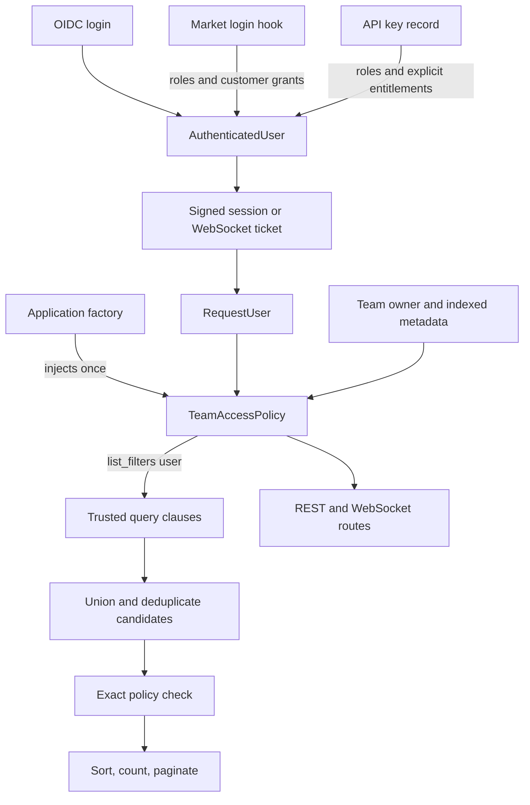

# Team access policy decisions

This document records the cross-package decisions for market-specific team
authorization in the Akgentic framework. The owning package is
`akgentic-infra`; the identity and enterprise storage packages implement the
supporting contracts.

## Status

Implemented across the package branches listed below. The framework default
remains backward compatible, while FI can opt into customer-entitlement
authorization through application configuration.

## Desired behavior

A deployment may provide a `TeamAccessPolicy` when building the application.
The policy decides which teams an authenticated user may list, create, or use.

The FI policy supports users accessing teams they own and, in the shared-team
mode, teams whose indexed customer metadata matches one of their customer
entitlements.

## Architecture



The list clauses narrow the database query. They are not the final
authorization decision. The exact policy check runs after candidate loading and
before pagination.

## ADR 1: Keep route access and team authorization separate

**Status: Approved and implemented**

Authentication and general route access answer who is calling and whether the
credential may enter an endpoint. Authentication middleware and role or scope
dependencies own those decisions.

`TeamAccessPolicy` answers whether that authenticated caller may act on a team
or set of teams. It operates on the authenticated `RequestUser` produced by
the earlier authentication layer.

Roles and scopes continue to protect broad capabilities. Team ownership and
customer entitlements remain resource-level decisions.

## ADR 2: Keep one coarse permission for an existing team

**Status: Approved and implemented**

The policy does not introduce separate viewer, editor, sender, owner, or
deleter permissions. If a policy grants access to an existing team, the caller
may perform the currently protected operations on that team, including REST,
workspace, and WebSocket operations.

Listing and creation remain separate policy questions because there is no
existing team to authorize in those flows.

## ADR 3: Inject the policy during application construction

**Status: Approved and implemented**

Community and enterprise application factories accept an optional custom
`TeamAccessPolicy`. The policy is forwarded through application wiring and
stored in the validated service container during construction.

The default remains `OwnerOrAdminPolicy`. A policy is a service, not a custom
module, so construction-time injection avoids post-construction state mutation
and gives REST and WebSocket paths the same policy instance.

## ADR 4: Expose typed entitlements on authenticated identities

**Status: Approved and implemented**

`AuthenticatedUser` and `RequestUser` carry the typed contract:

```python
entitlements: dict[str, list[str]] = Field(default_factory=dict)
```

Example:

```python
{"customer_id": ["1234", "5678"]}
```

`attributes` remains the extensible raw identity bag. Entitlements are a
separate, stable authorization contract, so policies do not need to consume
untyped claims.

Missing entitlements become an empty mapping. They never mean unrestricted
access, and Pydantic rejects values that are not lists of strings.

## ADR 5: Enrich users through the existing login hook

**Status: Approved and implemented**

Markets enrich `AuthenticatedUser` through `on_authenticated` before the user
is serialized into the session. The hook may preserve identity-provider roles,
add a market-admin role, and attach normalized customer entitlements.

The later session request reconstructs `AuthenticatedUser` and projects both
roles and entitlements onto `RequestUser`. The framework does not read a
market's admin-email whitelist itself.

For FI, Hallinta is the source of the user's customer grants. UPlus is a
separate customer-directory and eligibility integration; it does not replace
the identity entitlement contract.

## ADR 6: Preserve authorization through WebSocket tickets

**Status: Approved and implemented**

WebSocket tickets carry roles, scopes, and entitlements through issue and
redemption. They do not carry the raw `attributes` bag.

Claims introduced by this change default to empty when absent. A ticket issued
by an earlier version can therefore be redeemed during a rolling deployment
without gaining additional authorization.

## ADR 7: Entitlements are explicit for every supported credential

**Status: Approved and implemented**

Customer entitlements are trusted grants, not values inferred from a user ID.
They are populated only by an explicit credential or market contract:

- OIDC users receive normalized grants from the market login hook.
- API keys may receive grants explicitly when an administrator creates them.
- API-key entitlements are persisted by both YAML and Redis stores, projected
  during validation, and preserved during rotation.
- Legacy API-key records and credentials without an entitlement contract default
  to an empty mapping.
- Current M2M bearer service principals and community anonymous users remain
  empty unless a future trusted mapping supplies grants.

An admin API key is an admin because of its role. Customer entitlements are
independent and can be supplied to a non-admin API key for customer-scoped
policy testing or machine access.

The admin-only `/auth/apikeys` creation endpoint accepts:

```json
{"entitlements": {"customer_id": ["1234"]}}
```

## ADR 8: Team metadata is the customer authorization surface

**Status: Approved and implemented**

Customer-based access uses indexed `TeamMetadata` fields. The same metadata
contract drives team listing, exact authorization of an existing team, and
authorization before public team creation.

The metadata filter is an efficient narrowing mechanism. Because its existing
semantics include prefix matching, it cannot be the final permission decision.
Exact authorization compares canonical metadata index entries after loading the
candidate team.

No customer column, ownership rewrite, or storage migration is required.
Ownership remains the identity that created the team.

## ADR 9: OIDC subject remains the default team owner

**Status: Approved and implemented**

For a human session, the OIDC `sub` claim remains the owner identity:

```text
AuthenticatedUser.user_id -> RequestUser.user_id -> Process.user_id
```

The default policy compares this value exactly. A custom metadata policy may
widen or replace the access boundary without changing what ownership means.

## ADR 10: The policy controls union and intersection for listing

**Status: Approved and implemented**

The policy returns typed query clauses using the existing store vocabulary:

```python
class TeamListFilter(BaseModel):
    user_id: str | None = None
    metadata: dict[str, list[str]] | None = None


class TeamAccessPolicy(Protocol):
    async def list_filters(
        self,
        *,
        user: RequestUser,
    ) -> list[TeamListFilter]: ...
```

The combination rules are explicit:

- fields inside one `TeamListFilter` combine with AND;
- separate `TeamListFilter` instances combine with OR;
- an empty list denies every team;
- one filter with both fields unset is unrestricted.

Examples:

```python
# Owner only
[TeamListFilter(user_id=user.user_id)]

# Owner AND entitled customer
[TeamListFilter(user_id=user.user_id, metadata=user.entitlements)]

# Owner OR entitled customer
[
    TeamListFilter(user_id=user.user_id),
    TeamListFilter(metadata=user.entitlements),
]
```

`TeamService` executes the clauses, unions results, removes duplicate teams by
team ID, performs exact policy checks, and only then sorts, counts, and
paginates.

## ADR 11: Caller metadata may narrow but never widen authorization

**Status: Approved and implemented**

The trusted metadata filter comes from `TeamAccessPolicy`. Query parameters such
as `?meta.customer_id=` are caller-controlled search terms and must not be
merged into the policy metadata mapping. Merging could widen access because
terms for the same key OR together in the store.

The safe order is:

1. Execute the policy's trusted query clauses.
2. Union and deduplicate candidates.
3. Apply caller metadata as an additional narrowing condition.
4. Apply the policy's exact per-team authorization check.
5. Sort, count, and paginate.

## ADR 12: Administrator listing is configurable and backward compatible

**Status: Approved and implemented**

By default, administrators retain the historical listing behavior: they list
teams owned by their own `user_id`, even though they may open any known team by
ID.

The typed startup setting `AKGENTIC_ADMIN_LIST_ALL_TEAMS` enables unrestricted
administrator listing. When enabled, `OwnerOrAdminPolicy` returns one
unrestricted `TeamListFilter` for administrators. The setting is resolved when
application settings are constructed and passed into the policy; requests do
not call `os.getenv()`.

FI passes the same setting to its configured policy, so administrator listing
has consistent behavior in the default and customer-aware modes.

## ADR 13: FI rollout modes are explicit

**Status: Approved and implemented**

FI reads `FI_TEAM_ACCESS_MODE` at startup. The default value is
`owner_or_admin`, which retains the framework `OwnerOrAdminPolicy`.

The customer-aware modes are:

| Mode | Existing-team listing and access | Public creation |
| --- | --- | --- |
| `owner_and_customer` | Owner AND an entitled `customer_id` | Admin or an entitled customer |
| `owner_or_customer` | Owner OR an entitled `customer_id` | Admin or an entitled customer |

Customer IDs are normalized, deduplicated, and matched against canonical
`customer_id|<value>` metadata index entries. The policy fails closed when no
customer entitlement is present.

## ADR 14: Automated webhook creation uses explicit machine authority

**Status: Direction approved; migration deferred**

An inbound Salesforce webhook proves that its source is trusted, but it does
not produce a human `RequestUser` with customer entitlements. A future gateway
will call the protected team API with an explicit machine credential, currently
expected to be an admin credential.

The existing trusted internal ingestion path remains unchanged until that
gateway migration is ready. The gateway must use the normal authentication and
team-policy path rather than impersonating a human in-process.

## Implementation and validation

The framework implementation is complete across these surfaces:

- `akgentic-infra`: policy protocol, typed list clauses, construction-time
  wiring, listing and creation enforcement, exact team checks, and the typed
  admin-list setting;
- `akgentic-infra-auth`: typed identity and WebSocket-ticket entitlements,
  API-key creation, validation, backward-compatible defaults, and rotation;
- `akgentic-infra-enterprise`: Redis API-key persistence and projection;
- FI integration: Hallinta entitlement enrichment, UPlus customer eligibility,
  and the three rollout modes.

Validation completed for the cross-package change includes 317 auth tests, 18
focused enterprise API-key tests, 188 FI tests, and clean changed-file lint and
mypy checks. The package lockfiles must still be regenerated and committed
against the exact versions selected for the final merge.

## Release and merge notes

This record belongs in the framework Infra pull request because the authorization
protocol and application wiring are owned by `akgentic-infra`. Auth and
enterprise changes should be reviewed as supporting implementations of the same
contract. The FI repository supplies the market policy and login integration;
it does not redefine the framework protocol.

The implementation branches are:

| Package | Branch | Responsibility |
| --- | --- | --- |
| `akgentic-infra` | `feat/team-access-policy-wiring` | Policy protocol, listing, creation, and wiring |
| `akgentic-infra-auth` | `feat/team-entitlements-identity` | Identity, tickets, and API-key entitlements |
| `akgentic-infra-enterprise` | `feat/team-access-policy-wiring` | Redis API-key entitlement persistence |

Before merging the cross-package branches:

1. Regenerate and commit each package's `uv.lock` against the intended matching
   framework versions.
2. Run the complete CI-equivalent test and quality gates in the affected
   framework packages.
3. Resolve failures caused by the cross-package update; do not accept them as a
   merge exception without an explicit decision.
